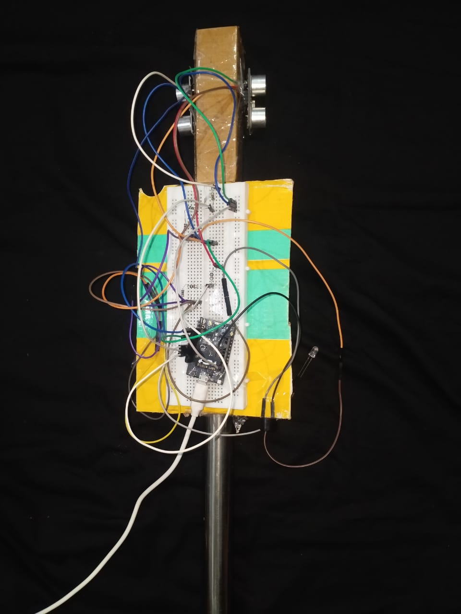
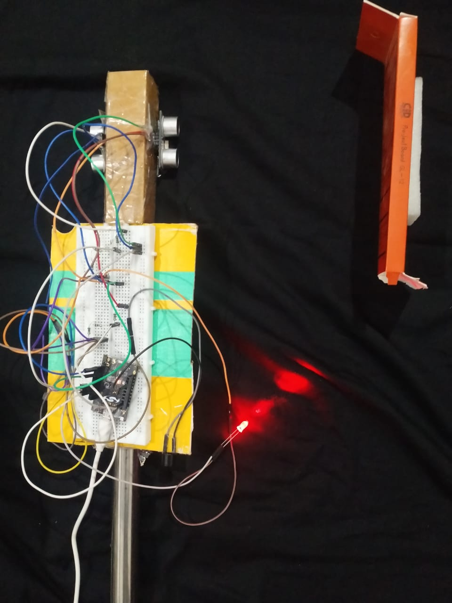
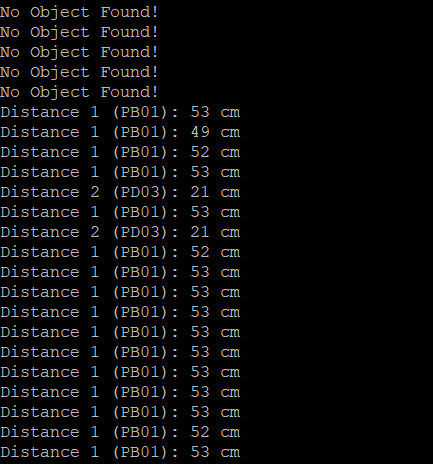
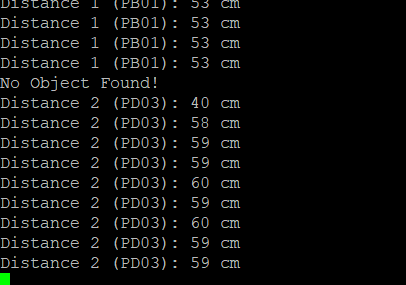
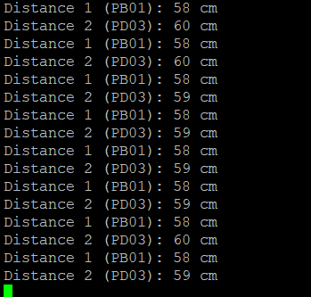

# Smart Blind Stick

A smart assistive device for visually impaired individuals, built using the EFR32BG22 microcontroller and dual ultrasonic sensors (HC-SR04). It detects obstacles and provides real-time feedback via buzzer and LED.

## Features
- Dual ultrasonic sensor-based distance measurement
- Visual (LED) and audio (buzzer) alerts
- Developed using Simplicity Studio and embedded C

## Hardware
- Thunderboard EFR32BG22 (BRD4184A Rev A01)
- HC-SR04 Ultrasonic Sensors
- Buzzer, LED, breadboard

## Software
- Simplicity Studio
- Embedded C
- TIMER0, GPIO, delay logic

## Circuit Overview
- Common TRIG pin on PA07
- Echo pins on PB01 and PD03
- LED on PB00, Buzzer on PC01

## 📽️ Demo  
### 🔍 TESTING IMAGES  

#### CASE 1 - No object around sensors (LED and Buzzer OFF)
- **Hardware Picture:**  
  
- **UART Reading Screenshot:**  
  

---

#### CASE 2 - Object detected on right sensor (LED and Buzzer ON)
- **Hardware Picture:**  
  
- **UART Reading Screenshot:**  
  

---

#### CASE 3 - Object detected on left sensor (LED and Buzzer ON)
- **UART Reading Screenshot:**  
  

---

#### CASE 4 - Object detected on both sensors (LED and Buzzer ON)
- **UART Reading Screenshot:**  
  

---